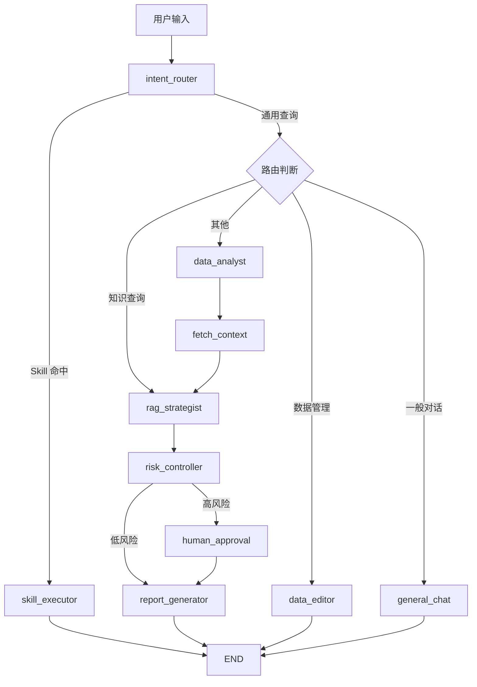

# AuraSaaS

面向连锁门店经营分析的 AI Agent 平台。基于 LangGraph 工作流与 ReAct Agent 双模式智能体引擎，融合 RAG 知识检索、Skill 插件体系、MCP 协议接入和 HITL 人工审批，实现从数据查询到策略生成的完整闭环。


[English](#english)

---

## 架构总览

```
┌──────────────────────────────────────────────────────────────┐
│                       Vue 3 Frontend                         │
│   Dashboard │ AI Analysis │ Products │ Staff │ Stores        │
│   Marketing │ Finance │ Reports │ Settings (Skills + MCP)    │
└──────────────────────────┬───────────────────────────────────┘
                           │ SSE / REST
┌──────────────────────────▼───────────────────────────────────┐
│                     FastAPI Backend                           │
│  ┌────────────┐  ┌──────────┐  ┌──────────────────────────┐ │
│  │ LangGraph   │  │  ReAct   │  │  Skill Executor          │ │
│  │ 11 nodes    │  │ 12 iter  │  │  review_reply /          │ │
│  │ + HITL      │  │ auto tool│  │  store_health            │ │
│  └────────────┘  └──────────┘  └──────────────────────────┘ │
│  ┌────────────────────────────────────────────────────────┐  │
│  │  5-tier Tool Calling (28 tools) + MCP Adapter          │  │
│  │  RAG (ChromaDB + Keyword) │ Trace & Replay                │  │
│  └────────────────────────────────────────────────────────┘  │
└──────────────────────────┬───────────────────────────────────┘
                           │
┌──────────────────────────▼───────────────────────────────────┐
│   PostgreSQL / SQLite │ ChromaDB │ Redis (optional)          │
│   DeepSeek API        │ MCP Servers (Filesystem, SQLite)     │
└──────────────────────────────────────────────────────────────┘
```

## Agent 执行流程




---

## 核心特性

### 双模式 Agent 引擎

- **智能路由** — 11 种经营意图分类，LLM 语义理解 + 关键词规则双重判断
- **ReAct Agent** — 低风险查询自主执行，最大 12 轮工具调用迭代，默认权限等级 3
- **LangGraph 工作流** — 11 节点 StateGraph 编排高风险操作，完整状态可序列化、可中断、可恢复
- **HITL 人工审批** — 风险操作自动暂停，SSE 实时推送审批请求至前端，支持批准 / 拒绝 / 修编三种决策

### Skill 插件体系

统一 Skill Schema（意图触发、工具声明、知识源注册、输出模板），支持热注册与自动发现。每个 Skill 拥有独立的 ChromaDB collection 实现 RAG 隔离。

内置示例 Skill：

| Skill | 功能 |
|---|---|
| `review_reply` | 差评分析与回复生成 |
| `store_health` | 门店多维度健康度诊断 |

### MCP 协议接入

自研轻量 MCP 客户端（JSON-RPC over stdio），支持 Filesystem 和 SQLite MCP Server。MCP Tool 自动适配为 Agent 工具，无需额外配置即可扩展 Agent 能力边界。

### RAG 知识检索

- **双通道召回** — ChromaDB 向量检索 + 关键词检索，Redis 缓存（TTL 5 分钟）
- **三级知识源** — 公共 SOP（8 份内置文档）、租户私有文档（PDF / DOCX / TXT / MD）、代码库索引（tree-sitter AST）
- **全降级可用** — ChromaDB 不可用时自动切换关键词检索，无 Redis 使用内存缓存

### Tool Calling 权限体系

21 个内置工具 + MCP 工具，按 5 个权限等级划分：

| 等级 | 类别 | 说明 |
|---|---|---|
| 1 | 只读 | 数据查询、指标获取 |
| 2 | 分析 | 趋势分析、异常检测 |
| 3 | 检索 | RAG 知识检索、记忆搜索 |
| 4 | 生成 | 报表生成、策略输出 |
| 5 | 写入 | 数据变更、配置修改 |

权限门控在工具执行前拦截越权调用，Write 操作自动升级为人工审批。

### 全链路可观测性

- 节点级执行追踪（状态、工具调用、耗时）
- trace_id 全程回放
- SSE 流式传输 + 前端工作流可视化
- 成本追踪（按会话统计 LLM 调用费用）

### 工程化

- 令牌桶限流、数据库连接池、JWT 鉴权
- 全组件支持降级：无 API Key / 无 Redis / 无 ChromaDB / 无 PostgreSQL 均可运行
- SQLite 零配置启动，内置中文 Demo 回答


---

## 技术栈

| 层 | 技术 |
|---|---|
| Agent 框架 | LangGraph, ReAct, Function Calling |
| RAG | ChromaDB, sentence-transformers, 关键词检索 |
| LLM | DeepSeek API（兼容 OpenAI 格式） |
| 后端 | Python 3.10+, FastAPI, SSE, SQLAlchemy 2.0 |
| 数据库 | PostgreSQL（生产）/ SQLite（开发）, Redis（可选） |
| MCP | 自研轻量 MCP Client（JSON-RPC over stdio） |
| 前端 | Vue 3, Vite 5, Pinia, ECharts 5, UnoCSS |
| 部署 | Docker, Docker Compose |

---

## 快速开始

### 前置要求

- Python 3.10+
- Node.js 18+
- （可选）Docker

### 1. 克隆项目

```bash
git clone https://github.com/Enndme-KK/AuraSaaS.git
cd AuraSaaS
```

### 2. 启动后端

```bash
cd backend
python -m venv venv
source venv/bin/activate   # Windows: venv\Scripts\activate
pip install -r requirements.txt
cp .env.example .env        # 编辑 .env，填入 DeepSeek API Key（可选）
python -m uvicorn app.main:app --reload --port 8000
```

后端启动后访问 http://localhost:8000/docs 查看 Swagger API 文档。

### 3. 启动前端

```bash
cd frontend
npm install
npm run dev
```

前端启动后访问 http://localhost:3000，注册账号即可使用。

### 4. Docker 一键部署

```bash
docker-compose up -d
```

### Demo 模式

不配置任何 API Key 也能完整运行：系统内置中文演示回答，SQLite 自动建表，ChromaDB 不可用时降级为关键词检索，数据库自动填充 Mock 数据。

---

## 项目结构

```
AuraSaaS/
├── backend/
│   ├── app/
│   │   ├── agents/              # Agent 引擎
│   │   │   ├── graph.py         # LangGraph 11 节点 StateGraph + HITL
│   │   │   ├── react_agent.py   # ReAct 自主 Agent 循环
│   │   │   ├── tool_schemas.py  # 5 级权限 + 工具元数据
│   │   │   ├── tools.py         # 工具注册入口
│   │   │   ├── toolkit/         # 工具实现（BI、营销、知识、记忆等）
│   │   │   └── nodes/           # LangGraph 节点实现
│   │   ├── skills/              # Skill 插件体系
│   │   │   ├── schema.py        # SkillSchema 定义
│   │   │   ├── registry.py      # SkillRegistry（线程安全单例）
│   │   │   ├── review_reply.py  # 差评回复 Skill
│   │   │   └── store_health.py  # 门店健康度诊断 Skill
│   │   ├── mcp/                 # MCP 协议适配层
│   │   │   ├── client.py        # 轻量 MCP Client + 降级模式
│   │   │   └── adapter.py       # MCP Tool → Agent Tool 适配
│   │   ├── api/                 # FastAPI 路由（14 个模块）
│   │   ├── services/            # LLM 客户端、RAG、数据清洗、Agent 表单
│   │   ├── models/              # SQLAlchemy ORM（11 个模型）
│   │   ├── core/                # 配置、鉴权、限流、Redis、可观测性
│   │   └── tests/               # 测试（105 tests, 7 modules）
│   ├── docs/knowledge/          # SOP 知识文档（Markdown）
│   ├── alembic/                 # 数据库迁移脚本
│   └── requirements.txt
├── frontend/
│   ├── src/
│   │   ├── views/               # 12 个页面（含 9 个认证页面 + 3 个公共页面）
│   │   ├── components/          # 公共组件
│   │   ├── composables/         # 组合式函数（Agent 分析、批量选择等）
│   │   ├── stores/              # Pinia 状态管理
│   │   └── utils/               # 请求封装、Markdown 渲染、国际化
│   └── package.json
├── sample_imports/              # 数据导入 Excel 模板
├── docker-compose.yml
└── README.md
```

---

## 测试

```bash
# 后端
cd backend
python -m pytest app/tests/ -v

# 前端
cd frontend
npm run build           # 构建检查
node scripts/lint.mjs         # 代码规范检查
```

---

## English

AuraSaaS is an AI Agent platform for multi-store chain business analytics. It combines a LangGraph workflow engine with a ReAct agent to deliver an end-to-end solution — from data querying and knowledge retrieval to strategy generation and human-in-the-loop approval.

### Key Capabilities

- **Dual-mode Agent routing** — LangGraph workflow (11 nodes + HITL) for high-risk operations, ReAct agent (max 12 iterations) for low-risk queries. Intent classification covers 11 business categories with LLM + keyword-based routing.
- **Skill Plugin System** — hot-swappable vertical agent solutions (review reply, store health diagnosis) with isolated RAG collections and auto-discovery.
- **MCP Protocol** — lightweight MCP client (JSON-RPC over stdio) supporting Filesystem and SQLite servers. External tools auto-register into the agent pool.
- **5-tier Tool Calling** — 21 built-in tools + MCP tools across Read → Analyze → Retrieve → Generate → Write tiers. Privilege gating prevents unauthorized calls; write operations auto-escalate to HITL.
- **Human-in-the-Loop** — pause-persist-resume workflow with SSE push to frontend. Supports approve, reject, and revise decisions.
- **RAG Retrieval** — dual-channel (ChromaDB vector + keyword), three-tier knowledge sources (8 built-in SOPs, tenant documents, codebase AST), Redis caching with graceful fallback.
- **Full Traceability** — per-node execution tracing with trace_id replay, SSE streaming, cost tracking per session.
- **Zero-config Demo** — runs on SQLite without API key, Redis, or ChromaDB. Demo responses and mock data included.

### Quick Start

```bash
# Backend
cd backend && pip install -r requirements.txt
cp .env.example .env
uvicorn app.main:app --reload --port 8000

# Frontend
cd frontend && npm install && npm run dev
```

Open http://localhost:3000 and register an account to get started.

### Tech Stack

| Layer | Technology |
|---|---|
| Agent | LangGraph, ReAct, Function Calling |
| RAG | ChromaDB, sentence-transformers, keyword retrieval |
| Backend | Python, FastAPI, SSE, SQLAlchemy |
| Database | PostgreSQL / SQLite, Redis (optional) |
| MCP | Custom lightweight MCP Client (JSON-RPC over stdio) |
| Frontend | Vue 3, Vite 5, Pinia, ECharts 5, UnoCSS |
| Deployment | Docker, Docker Compose |
| LLM | DeepSeek API (OpenAI-compatible) |

### Project Structure

```
AuraSaaS/
├── backend/
│   ├── app/
│   │   ├── agents/        # LangGraph workflow + ReAct Agent + Tool Calling
│   │   ├── skills/        # Skill plugin system
│   │   ├── mcp/           # MCP protocol adapter
│   │   ├── api/           # FastAPI routes (14 modules)
│   │   ├── services/      # LLM client, RAG, data cleaning
│   │   ├── models/        # SQLAlchemy ORM (11 models)
│   │   ├── core/          # Config, auth, rate limiting, observability
│   │   └── tests/         # 105 tests, 7 modules
│   ├── docs/knowledge/    # SOP knowledge documents (Markdown)
│   ├── alembic/           # Database migrations
│   └── requirements.txt
├── frontend/
│   ├── src/
│   │   ├── views/         # 12 pages
│   │   ├── components/    # Shared components
│   │   ├── composables/   # Composables
│   │   ├── stores/        # Pinia stores
│   │   └── utils/         # Request, markdown, i18n
│   └── package.json
├── docker-compose.yml
└── README.md
```


## Screenshots


