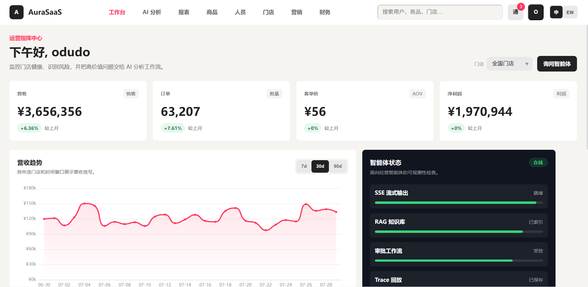
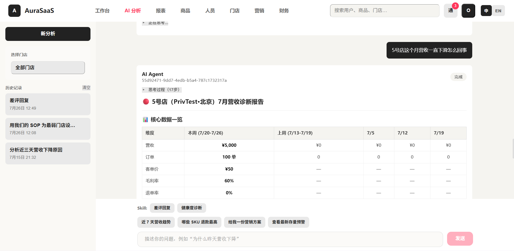
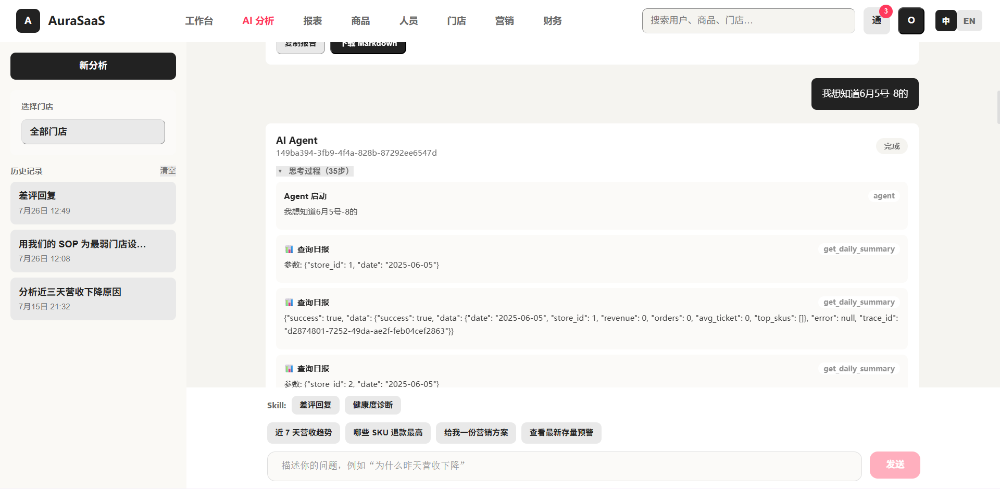
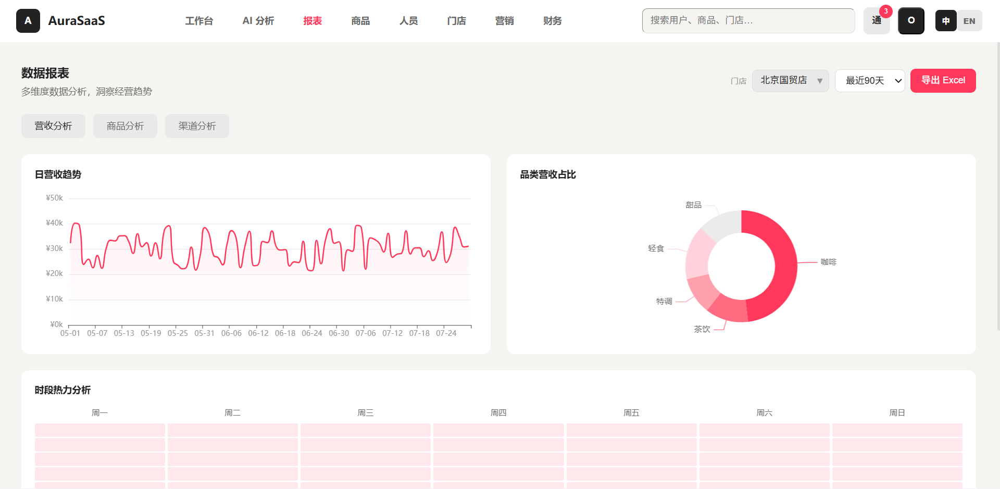
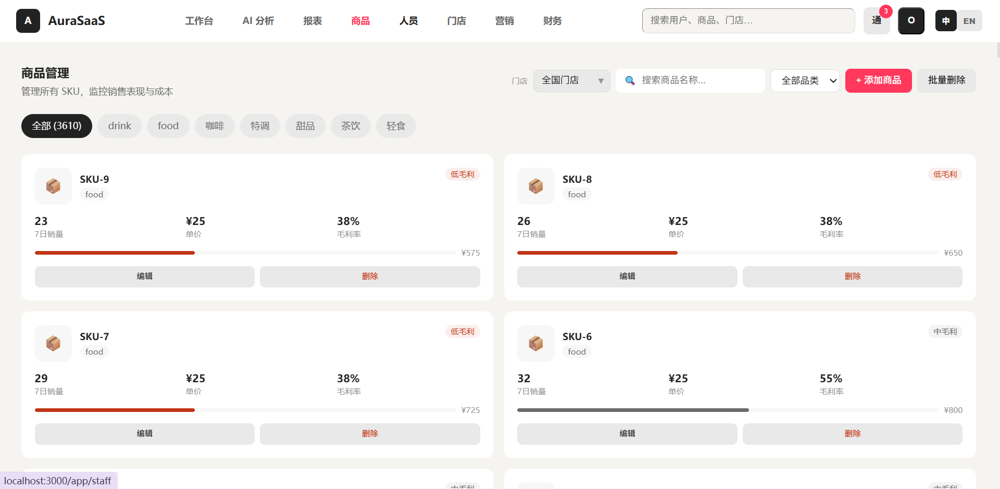
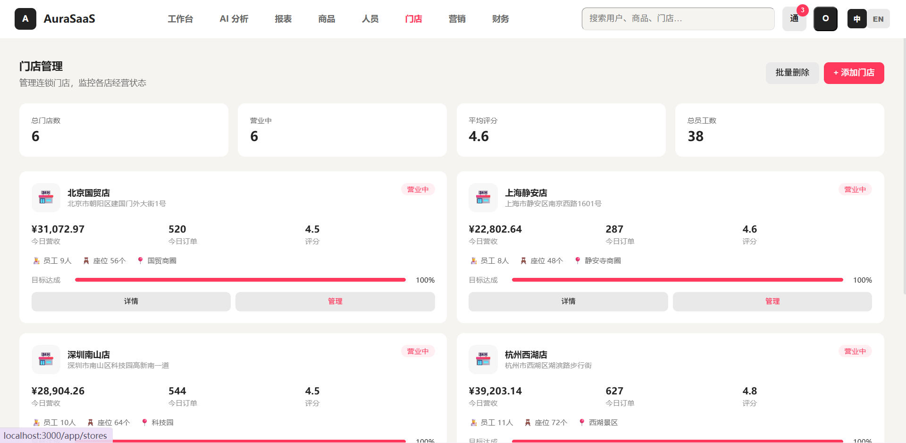
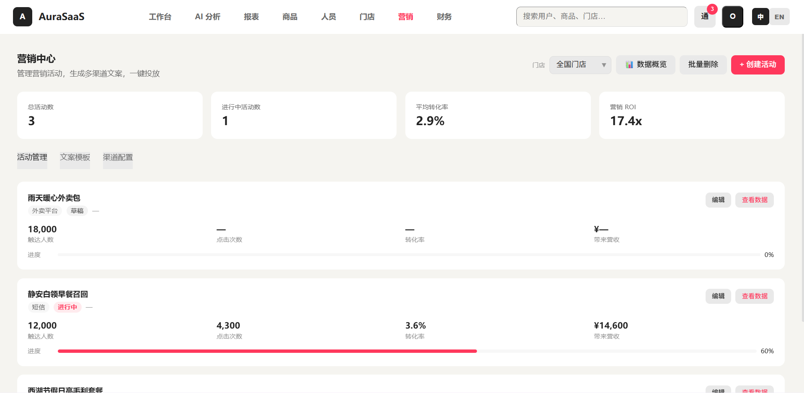
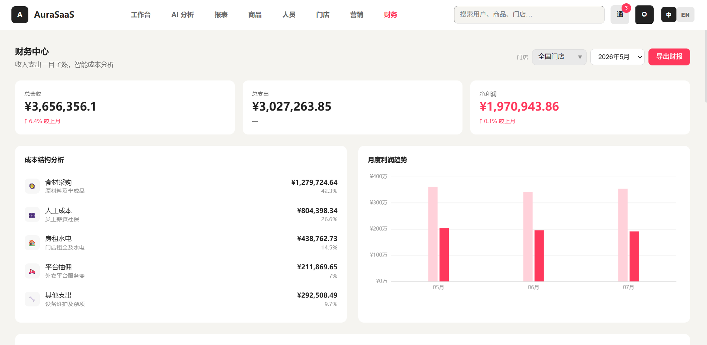
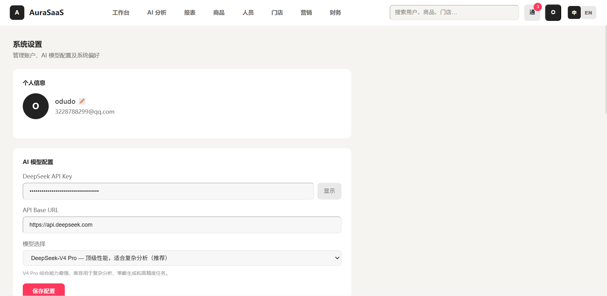

# AuraSaaS

[English](README.md)

开源 AI 商业智能 Agent 平台，面向多门店连锁经营场景。

AuraSaaS 集成了 LangGraph Agent 工作流编排、RAG 知识检索、5 级 Tool Calling 权限体系、人工审批（HITL）机制和全链路执行追踪，前端基于 Vue 3 仪表盘，后端基于 FastAPI。



## 核心特性

### Agent 工作流

- **双模式自动路由** — 统一入口 `/api/agent/stream` 通过 LLM + 关键词双通道将用户问题分类为 **11 种意图**，高风险意图（营销方案、异常诊断、报告生成等）走 LangGraph 管线 + HITL 审批，快速查询（数据查看、知识问答等）走 ReAct Agent 自主工具调用。
- **10 节点 LangGraph 管线** — Phase 1：`intent_router → data_analyst → fetch_context → rag_strategist → risk_controller → human_approval`；Phase 2（审批通过后）：`copywriter → report_generator`。条件边根据意图自动跳过无关节点。
- **ReAct Agent 循环** — Think-Act-Observe 模式，最多 12 轮迭代，自主选择工具，支持多轮对话上下文。



### RAG 知识检索

- **三层检索架构**：公开 SOP 文档（8 篇内置 Markdown）、租户私有文档上传（PDF/DOCX/TXT/MD）、代码库索引（tree-sitter AST 切片，支持 Python/JavaScript/Java）。
- **双通道检索**：ChromaDB 向量相似度 + 关键词 fallback，即使无 Embedding 模型或网络也能正常检索。
- **自动切片**：公开文档按 900 字符窗口 + 120 字符重叠切分；租户文档可配置。

### Tool Calling 工具体系

- **22 个工具**，按 **5 级权限** 分类：

| 等级 | 名称 | 能力范围 | 代表工具 |
|------|------|---------|---------|
| Lv1 | 只读 | 查询存量数据 | `get_daily_summary`、`list_all_stores`、`get_store_detail` |
| Lv2 | 分析 | 检测与预测 | `detect_anomalies`、`forecast_metric`、`compare_periods`、`rank_stores` |
| Lv3 | 检索 | 搜索知识库 | `search_knowledge_base`、`search_agent_memory` |
| Lv4 | 生成 | 创建内容（需审批） | `generate_marketing_strategy`、`generate_campaign_copy`、`evaluate_strategy_risk` |
| Lv5 | 写入 | 修改数据（需审批） | `add_product`、`create_anomaly_tasks`、`save_agent_memory` |

- **权限门控**：ReAct Agent 默认运行在 Lv3，Lv4-Lv5 工具需通过 LangGraph HITL 路径提升权限后方可调用。越权调用抛出 `PrivilegeEscalationError`。

### HITL 人工审批

- **暂停-持久化-恢复**：Agent 生成高风险策略后，LangGraph 管线在 `human_approval` 节点暂停，将完整状态序列化到数据库，前端收到 `approval_required` SSE 事件。
- **三种审批操作**：批准（自动创建活动草稿并恢复 Phase 2 生成文案和最终报告）、拒绝、修编（退回修改）。
- **决策记忆**：审批结论和诊断结果自动写入 `AgentMemory`，供后续推理参考。

### 执行链路追踪

- 每次 Agent 运行生成结构化 `AgentTrace` 记录，包含节点级事件、工具调用参数、每节点耗时和最终答案。
- **SSE 实时流**：前端通过 `AgentPipeline` 组件实时展示管线节点状态。
- **Trace 重放**：按 `trace_id` 回放完整执行过程。
- **性能指标**：Token 用量、累计费用（含预算熔断）、RAG 命中率，每次运行记录到日志。

### BI 仪表盘

- KPI 概览卡片（含环比变化指示器）。
- 营收趋势图（ECharts），支持切换时间范围。
- 热销 SKU 热力图、门店排行、异常告警列表。
- 管理页面：门店、商品（SKU）、员工、营销活动、财务、报表。

### 平台能力

- **认证**：JWT 双 Token（access/refresh）自动续期，401 自动拦截跳转登录。
- **限流**：全端点请求频率控制。
- **成本熔断**：LLM Token 累计费用达到 `AGENT_BUDGET_YUAN` 自动拦截后续请求。
- **统一响应**：所有 API 返回 `{code, data, message}` 信封格式；SSE 使用类型化事件流。



## 架构总览

```text
用户提问
    │
    ▼
┌──────────────────────────────────────────┐
│   POST /api/agent/stream  (自动路由)      │
│                                          │
│   关键词意图分类                           │
│        │                      │          │
│    高风险                    快速查询     │
│        ▼                      ▼          │
│   LangGraph 管线          ReAct Agent    │
│   (10节点 + HITL)       (思考-行动循环)   │
└──────────────────────────────────────────┘

LangGraph Phase 1:
  intent_router → data_analyst → fetch_context
    → rag_strategist → risk_controller → human_approval
                                              │
                                       ┌──────┴──────┐
                                       │  暂停        │
                                       │  状态持久化   │
                                       │  → AgentTrace│
                                       └──────┬──────┘
                                              │ 用户批准
                                              ▼
LangGraph Phase 2 (通过 /stream-resume):
  copywriter → report_generator → END
```

## 技术栈

| 层级 | 技术 |
|------|------|
| 前端 | Vue 3, Vite 6, Pinia, Vue Router, ECharts, UnoCSS, Marked |
| 后端 | FastAPI (Python), LangGraph, SQLAlchemy 2, Pydantic v2, Alembic |
| AI / LLM | DeepSeek API（兼容 OpenAI 格式），支持无 Key 演示模式 |
| RAG | ChromaDB, sentence-transformers, tree-sitter（代码解析） |
| 数据库 | SQLite（本地/演示），Alembic 迁移 |
| 认证 | JWT（python-jose + passlib），速率限制 |
| DevOps | GitHub Actions CI |

## 快速开始

### 环境要求

- Python 3.10+
- Node.js 18+
- （可选）DeepSeek 或 OpenAI 兼容 API Key，用于启用完整 LLM 功能

### 1. 克隆并配置

```bash
git clone https://github.com/Enndme-KK/AuraSaaS.git && cd AuraSaaS
cp .env.example .env
```

编辑 `.env`，将 `DEEPSEEK_API_KEY` 设置为你的 API Key。保留占位符可进入演示模式，Agent 将使用模板降级回复。

### 2. 启动后端

```bash
cd backend
pip install -r requirements.txt
python -m app.scripts.ingest_knowledge    # 将 SOP 文档索引到 ChromaDB
uvicorn app.main:app --reload --port 8000
```

首次启动时，如果数据库为空，会自动填充演示数据（4 家门店、90 天指标、SKU、外部因素）。

### 3. 启动前端

```bash
cd frontend
npm install
npm run dev
```

浏览器打开 `http://localhost:3000`，注册账号后即可体验。

> 升级后如遇数据库字段错误，删除 `backend/aura.db` 让系统重新建表。

## 环境变量

| 变量 | 默认值 | 说明 |
|------|--------|------|
| `DEEPSEEK_API_KEY` | `your-deepseek-api-key` | LLM API Key，占位符启用演示模式 |
| `DEEPSEEK_BASE_URL` | `https://api.deepseek.com` | LLM API 地址 |
| `OPENAI_API_BASE` | `https://api.deepseek.com` | 备选 API 地址 |
| `DATABASE_URL` | `sqlite:///./aura.db` | 数据库连接 URL |
| `CHROMA_DIR` | `./data/chroma` | ChromaDB 持久化目录 |
| `CODE_EMBEDDING_CACHE_DIR` | `./data/huggingface` | HuggingFace 模型缓存目录 |
| `JWT_SECRET` | `change-me-in-production` | JWT 签名密钥（非本地环境务必修改） |
| `ENVIRONMENT` | `local` | 运行环境：`local`、`development`、`test` 或生产环境名 |
| `SEED_DEMO_ON_STARTUP` | `true` | 首次启动时自动填充演示数据 |
| `FORCE_RESEED_DEMO` | `false` | 强制重新填充演示数据 |
| `CORS_ORIGINS` | `http://localhost:3000,...` | 允许的前端域名（逗号分隔） |
| `LLM_TIMEOUT_SECONDS` | `30` | LLM 请求超时时间 |
| `LLM_MAX_RETRIES` | `2` | 瞬态网络错误最大重试次数 |
| `AGENT_BUDGET_YUAN` | `0.02` | 单会话 LLM 费用上限 |

## 项目结构

```text
AuraSaaS/
├── backend/
│   ├── app/
│   │   ├── agents/              # LangGraph 工作流、ReAct Agent、工具集
│   │   │   ├── nodes/           # data_analysis 节点（BI 信号采集）
│   │   │   └── toolkit/         # 9 个工具模块：bi、analytics、marketing 等
│   │   ├── api/                 # 14 个 FastAPI 路由模块
│   │   ├── core/                # 配置、安全、限流、可观测性
│   │   ├── models/              # 14 张 SQLAlchemy ORM 模型
│   │   ├── schemas/             # Pydantic 请求/响应 Schema
│   │   ├── services/            # RAG 服务、LLM 客户端、数据清洗、Agent 表单
│   │   └── tests/               # pytest 测试套件（工具、图节点、权限、API）
│   ├── alembic/                 # 数据库迁移脚本
│   ├── data/chroma/             # ChromaDB 向量存储
│   └── requirements.txt
├── frontend/
│   ├── src/
│   │   ├── components/          # AgentPipeline、ThoughtStream、StatCard 等 16 个组件
│   │   ├── composables/         # useAgentAnalysis（核心 SSE 流 + 状态管理）
│   │   ├── views/               # 12 个页面（AI分析、仪表盘、门店、商品等）
│   │   ├── stores/              # Pinia 状态管理（认证、仪表盘数据）
│   │   └── utils/               # HTTP 客户端、SSE 解析器、Markdown 渲染、i18n
│   └── package.json
├── docs/knowledge/              # 8 篇内置 SOP / 策略 Markdown 文档
├── sample_imports/              # 示例 CSV 导入文件
├── docker-compose.yml
└── .env.example
```

## API 参考 — Agent 端点

| 方法 | 路径 | 说明 |
|------|------|------|
| `POST` | `/api/agent/stream` | 统一入口：根据意图自动路由到 LangGraph 或 ReAct |
| `GET` | `/api/agent/stream-diagnose` | LangGraph SSE（直接调用，跳过自动路由） |
| `POST` | `/api/agent/stream-react` | ReAct Agent SSE（直接调用） |
| `GET` | `/api/agent/stream-resume` | HITL 审批通过后恢复 Phase 2 |
| `POST` | `/api/agent/approve` | 审批操作：批准 / 拒绝 / 修编 |
| `GET` | `/api/agent/approvals` | 列出审批请求 |
| `GET` | `/api/agent/traces` | 列出最近的 Agent 追踪记录 |
| `GET` | `/api/agent/traces/{trace_id}` | 追踪详情（含时间线步骤） |
| `POST` | `/api/agent/replay/{trace_id}` | 重放已保存的追踪 |
| `DELETE` | `/api/agent/traces/{trace_id}` | 删除单条追踪 |
| `DELETE` | `/api/agent/traces` | 清空全部追踪 |
| `POST` | `/api/agent/forms/preview` | 根据自然语言生成可填写的经营操作表格 |
| `POST` | `/api/agent/forms/submit` | 校验并提交 Agent 表单 |

其他路由模块：`/api/auth/*`、`/api/dashboard/*`、`/api/rag/*`、`/api/tenant-knowledge/*`、`/api/import/*`、`/api/sku/*`、`/api/staff/*`、`/api/finance/*`、`/api/system/*`、`/api/tasks/*`。

## 测试

```bash
# 后端 — 全部测试套件
cd backend
pytest app/tests/ -v

# 按套件运行
pytest app/tests/test_tools.py -v       # 19 个用例 — 全权限等级工具执行测试
pytest app/tests/test_graph_nodes.py -v # 26 个用例 — 图编译、路由、RAG、SSE
pytest app/tests/test_privilege.py -v   # 14 个用例 — 5 级权限门控测试

# 前端
cd frontend
npm run build    # 类型检查 + 生产构建
npm run lint
```

## 常见问题

**Q: Agent 显示"演示模式"，如何启用真实 AI？**

在 `.env` 中将 `DEEPSEEK_API_KEY` 设置为有效的 DeepSeek 或 OpenAI 兼容 API Key。平台兼容任何 OpenAI 兼容端点。

**Q: 为什么 Agent 会暂停并要求审批？**

路由到 LangGraph 管线的查询（营销方案、异常诊断、报告生成、数据管理）包含风险评估步骤。如果方案超过风险阈值，将暂停等待人工审核。快速数据查询走 ReAct Agent，不需要审批。

**Q: 如何添加自定义知识文档？**

将 Markdown 文件放入 `docs/knowledge/` 并重新运行 `python -m app.scripts.ingest_knowledge`。或通过前端 RAG 面板 / `POST /api/rag/upload` 上传 PDF/DOCX/TXT/MD 文件。

**Q: 启动时报数据库字段缺失错误？**

删除 `backend/aura.db` 强制重新建表；或系统会在启动时通过 `ensure_demo_schema()` 自动补齐缺失字段。

## 参与贡献

欢迎参与贡献。请在提交 Pull Request 前先创建 Issue 讨论改动方案。详见 [CONTRIBUTING.md](CONTRIBUTING.md) 和面向新手的 [GOOD_FIRST_ISSUES.md](GOOD_FIRST_ISSUES.md)。

## 开源协议

MIT License。详见 [LICENSE](LICENSE)。

## 界面展示












